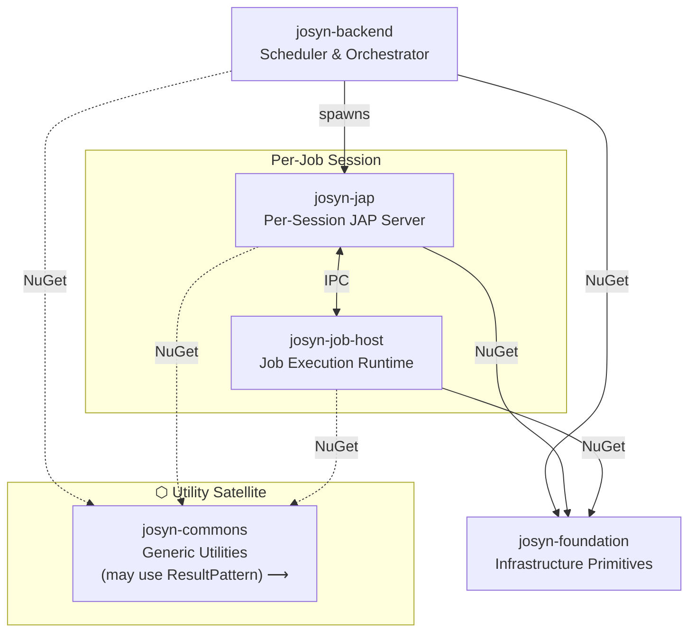

# JOSYN Platform

> **This repo is the authoritative architectural reference for the entire JOSYN platform.**
> Start here before working in any other repo.

---

## What is JOSYN?

JOSYN (Job System Next) is a platform for executing scheduled jobs as isolated executable processes. A central scheduler orchestrates job execution: it spawns job processes, hands them arguments via a named-pipe protocol, and receives results or error reports in return.

---

## The Six Repos

| Repo | Role | Namespace root |
|------|------|----------------|
| [`josyn-foundation`](../josyn-foundation) | Infrastructure primitives — Result pattern, serialization, IPC transport | `JOSYN.Foundation.*` |
| [`josyn-jap`](../josyn-jap) | Per-session JAP server — JAPServer EXE, shared contracts, logging | `JOSYN.Jap.*` |
| [`josyn-job-host`](../josyn-job-host) | Job execution runtime — library linked by each job executable | `JOSYN.JobHost` |
| [`josyn-backend`](../josyn-backend) | Scheduler and session-orchestration layer — triggers sessions, spawns JAPServer | `JOSYN.Backend.*` |
| [`josyn-commons`](../josyn-commons) | Generic utility helpers — domain-agnostic, open for growth, never referenced by foundation | `JOSYN.Commons.*` |
| **`josyn-platform`** *(this repo)* | Architecture, decisions, and cross-cutting documentation | — |

### Why `josyn-job-host` uses a two-segment namespace

Job executables are **decoupled consumers** of the JOSYN protocol, not internal components of the scheduling system. They link `josyn-job-host`, follow the protocol, and exit. This architectural separation is intentional: the repo name (`josyn-job-host`, not `josyn-jap-job-host`) signals it at the repo boundary, and `JOSYN.JobHost` (two-segment, no "Jap") signals it at the API surface — hiding the internal protocol layer from job authors. See [decisions/ADR-001-platform-naming.md](decisions/ADR-001-platform-naming.md).

### Why `josyn-backend` is separate from `josyn-jap`

`josyn-backend` owns the *when* and *what* of job execution (scheduling, session persistence, JAPServer spawning). `josyn-jap` owns only the *how* of a single in-flight session (the JAP protocol server, including spawning the job executable). They are coupled solely by the session GUID passed on the command line — there is no NuGet dependency between them. See [decisions/ADR-002-josyn-backend.md](decisions/ADR-002-josyn-backend.md).

---

## Vocabulary

| Word | Meaning in this codebase |
|------|--------------------------|
| **Platform** | The entire JOSYN ecosystem — all six repos together |
| **Backend** | The scheduler and session-orchestration layer (`josyn-backend`) |
| **JAP** | The per-session JAP protocol server and shared packages (`josyn-jap`) |
| **Job Host** | The runtime embedded in each job executable (`josyn-job-host`) |
| **Foundation** | Cross-cutting infrastructure primitives (`josyn-foundation`) |
| **Commons** | Generic utility helpers — domain-agnostic toolbox, open for growth (`josyn-commons`) |

See [architecture/naming-conventions.md](architecture/naming-conventions.md) for the full naming guide.

---

## Architecture at a glance

Full architecture: [architecture/overview.md](architecture/overview.md)

---

## Key cross-cutting decisions

- All operations return `Result` / `Result<T>` — no exceptions propagate between layers
- All serialization is via `PropertyBag` — INI or JSON, culture `de-DE`
- IPC uses named pipes with GUID session isolation (`josyn-foundation-jip`)
- Error messages in **German**; documentation and session files in **English**
- All packages target `.NET 10.0`, `Nullable=enable`, `LangVersion=latest`

Coding standards: [architecture/coding-standards.md](architecture/coding-standards.md)

---

## Status

All repos at version `1.0.0-preview01` — active PoC phase. `josyn-backend` is a compilable stub.

See [decisions/](decisions/) for architectural decision records.
