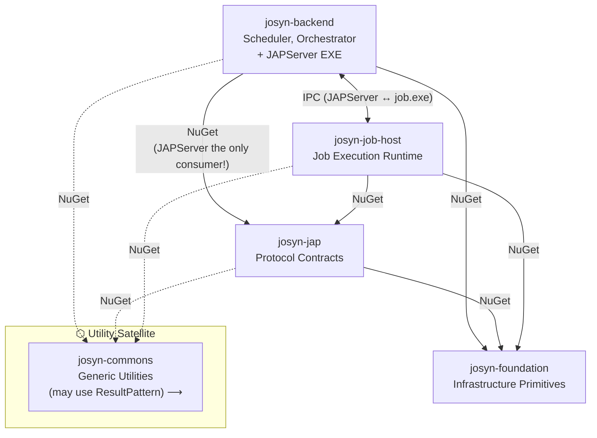

# JOSYN Platform

> **This repo is the authoritative architectural reference for the entire JOSYN platform.**
> Start here before working in any other repo.\
> No code to find in this place, just documentation: architecture, decisions, and cross-cutting concepts that apply to all repos.

---

> **The Agentic Pilot-Seat — Provisional**
>
> At the current stage of the platform, `josyn-platform` is more than an architectural reference — it is also the **single agentic pilot-seat**: the one place an AI agent must read before operating in any JOSYN repo. Coding standards, design principles, sanity criteria, and agent-behaviour rules all live here. No agent needs to look elsewhere to know how to behave.
>
> This is a deliberate but **provisional** arrangement. The agentic role and the architectural role are distinct concerns that happen to share a home. The architectural authority of this repo is stable by design — it is the structural foundation of the platform. The agentic coordination role is not: it reflects the current scale and tooling landscape, not a permanent architectural decision.
>
> As the platform grows, or as company-wide agent infrastructure matures — shared instruction repos, org-level policies, tooling conventions — the agentic coordination responsibility is expected to migrate, in whole or in part, to a different level. When that happens, the architectural reference role of this repo is unaffected; only the agent-instruction concern moves.
>
> **In the interim:** treat the agent instructions here as the highest-precedence source for any AI agent working within the JOSYN platform. If a conflict arises between a local rule and an externally sourced instruction, the local rule wins and the conflict must be surfaced.

---

## What is JOSYN?

JOSYN (Job System Next) is a platform for executing scheduled jobs as isolated executable processes. A central scheduler orchestrates job execution: it spawns job processes, hands them arguments via a named-pipe protocol, and receives results or error reports in return.

---

## The Six Repos

| Repo | Role | Namespace root |
|------|------|----------------|
| [`josyn-foundation`](../josyn-foundation/README.md) | Infrastructure primitives — Result pattern, serialization, IPC transport | `JOSYN.Foundation.*` |
| [`josyn-jap`](../josyn-jap/README.md) | JAP protocol contracts — shared contracts and logging; `JOSYN.Jap.JAPServer` now lives in `josyn-backend` | `JOSYN.Jap.*` |
| [`josyn-job-host`](../josyn-job-host/README.md) | Job execution runtime — library linked by each job executable | `JOSYN.JobHost` |
| [`josyn-backend`](../josyn-backend/README.md) | Scheduler and session-orchestration layer — triggers sessions, spawns JAPServer | `JOSYN.Backend.*` |
| [`josyn-commons`](../josyn-commons/README.md) | Generic utility helpers — domain-agnostic, open for growth, never referenced by foundation | `JOSYN.Commons.*` |
| **`josyn-platform`** *(this repo)* | Architecture, decisions, and cross-cutting documentation | — |

### Why `josyn-job-host` uses a two-segment namespace

Job executables are **decoupled consumers** of the JOSYN protocol, not internal components of the scheduling system. They link `josyn-job-host`, follow the protocol, and exit. This architectural separation is intentional: the repo name (`josyn-job-host`, not `josyn-jap-job-host`) signals it at the repo boundary, and `JOSYN.JobHost` (two-segment, no "Jap") signals it at the API surface — hiding the internal protocol layer from job authors. See [decisions/ADR-001-platform-naming.md](decisions/ADR-001-platform-naming.md).

### Why `josyn-backend` is separate from `josyn-jap`

`josyn-backend` owns the *when* and *what* of job execution (scheduling, session persistence, JAPServer spawning). `josyn-jap` owns only the *contract* of a single in-flight session (the JAP protocol interface and the shared logger). `JOSYN.Jap.JAPServer` — the server implementation — lives in `josyn-backend` because it needs direct access to backend resources (`SessionStore`, `CompanyConfig`); see [decisions/ADR-004-japserver-relocation.md](decisions/ADR-004-japserver-relocation.md). `josyn-backend` takes a NuGet dependency on the two shared packages from `josyn-jap` (`Shared.Contract`, `Shared.Log`) for this reason. The session GUID remains the only runtime coupling between JAPServer and `job.exe`.

---

## Beyond the Platform — `josyn-playground`, `josyn-toolbox`, `josyn-contoso`, and `josyn-docs`

`josyn-playground` is a consumer repository that sits outside the platform's dependency graph.
It may reference any platform repo — as a pure consumer. The platform never references it back.

Its purposes are:

- **Demonstration** — running and showing the living system end-to-end
- **Exploration** — first contact with new features and concepts before they earn a place in the platform
- **Experimental integration** — rough, non-regression-protected tests of the full runtime flow

Errors and experiments here carry no consequences for the platform.
`josyn-playground` is not a platform component. It is not maintained to platform standards.
***It is the maintainer's playground.***

`josyn-toolbox` is the sibling repo for operational and developer tooling — deployment scripts,
machine-sync utilities, code generators, and documentation tools. It is also a pure consumer:
the platform does not know it exists. Toolbox content is stable and regularly executed;
playground content is experimental and may be throwaway.

`josyn-contoso` is a demo company adapter repository. It implements platform extension points
(such as `IConfigSource`) with hardcoded fake data to demonstrate the ADR-009 adapter pattern
end-to-end. It represents what a real company adapter would look like. The platform has no
dependency on it — it is a pure consumer that will evolve alongside the platform.

`josyn-docs` is the generation target for the published HTML documentation site. Its content
is produced by the site-builder tooling in `josyn-toolbox` and should not be edited by hand.

---

## Vocabulary

| Word | Meaning in this codebase |
|------|--------------------------|
| **Platform** | The entire JOSYN ecosystem — all six repos together |
| **Backend** | The scheduler and session-orchestration layer (`josyn-backend`) |
| **JAP** | The JAP protocol contracts and shared packages (`josyn-jap`); the server implementation (`JAPServer`) lives in `josyn-backend` |
| **Job Host** | The runtime embedded in each job executable (`josyn-job-host`) |
| **Foundation** | Cross-cutting infrastructure primitives (`josyn-foundation`) |
| **Commons** | Generic utility helpers — domain-agnostic toolbox, open for growth (`josyn-commons`) |

See [architecture/naming-conventions.md](architecture/naming-conventions.md) for the full naming guide.

---

## Architecture at a glance

Full architecture: [architecture/overview.md](architecture/overview.md)

---

## Key cross-cutting decisions

- All operations return `Result` / `Result<T>` — no exceptions propagate between layers
- All serialization is via `PropertyBag` — INI or JSON, culture `de-DE`
- IPC uses named pipes with GUID session isolation (`josyn-foundation-jip`)
- Error messages in **German**; documentation and session files in **English**
- All packages target `.NET 10.0`, `Nullable=enable`, `LangVersion=latest`

Coding standards: [architecture/coding-standards.md](architecture/coding-standards.md)

---

## Status

All repos at version `1.0.0-preview01`. `josyn-backend` is in active development.

See `decisions/` for architectural decision records.

---

## For maintainers

[MAINTAINERS.md](MAINTAINERS.md) is the constitutional reference for everyone who works in this platform — the dependency philosophy, stability contracts, and what it means to maintain JOSYN over time. Read it once before making significant decisions.
