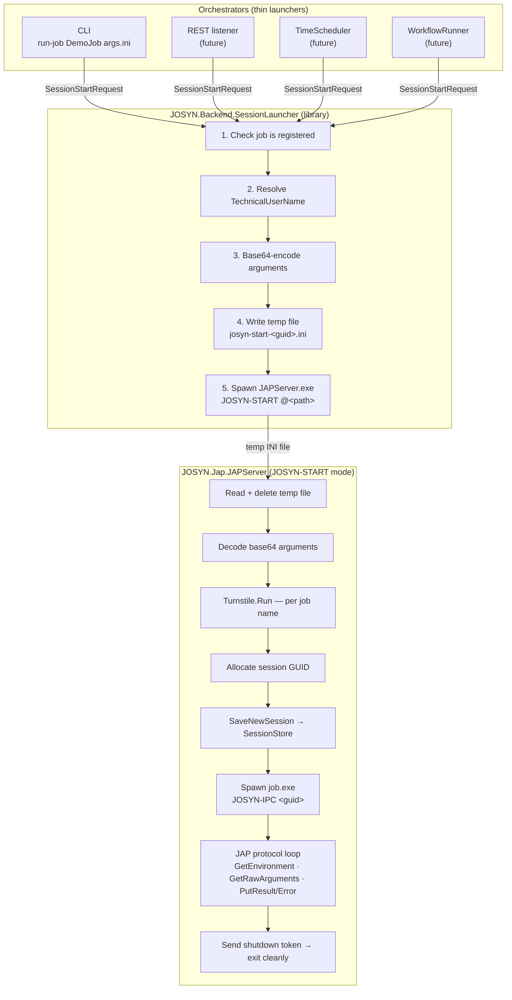

# Guide — Session Launch

**Relates to:** ADR-007 (Session-Starter Relocation)
**State:** Settled

---

## What happens when you start a job?

This guide explains the session-launch flow for a reader unfamiliar with the
`SessionLauncher` / `JAPServer` split. For the formal decisions see ADR-007.

---

## The core idea

Orchestrators do not manage sessions. They describe *what* to run and hand it off.
Everything else — GUID allocation, persistence, concurrency control, process spawning —
is `JAPServer`'s concern.

---

## Why this split?

Previously every orchestrator carried its own session-start logic. Four orchestrators →
four copies of the same GUID allocation, persistence, and concurrency code.

Now:

- **Orchestrators** construct a `SessionStartRequest` and call `SessionLauncher.LaunchSession()`.
  One line. No session lifecycle knowledge required.
- **`SessionLauncher`** (a NuGet library) handles pre-launch checks and spawns JAPServer.
- **JAPServer** owns the session from start to finish — GUID, `SessionStore`, Turnstile
  lock, job process, and protocol loop.

---

## The temp file

JAPServer is a separate process — arguments can't be passed on the command line (size
limit, no audit trail). The orchestrator writes a short-lived INI file, passes its path
prefixed with `@`, and JAPServer reads and **immediately deletes** it.

The filename contains a throwaway `Guid.NewGuid()` solely to avoid collisions — it is
never stored. The session GUID is allocated later, inside JAPServer, inside the Turnstile.

---

## The base64 detail

Job arguments are an INI file. That content has to travel inside `SessionStartRequest`,
which is itself serialised as an INI file (the temp file). INI has no quoting mechanism
for multiline values — embedding raw INI-in-INI would silently truncate at the first
newline.

The rule: `SessionStartRequest.Arguments` is **always base64-encoded**.

| Step | Who | What |
|------|-----|------|
| Populate `SessionStartRequest.Arguments` | Orchestrator | `Convert.ToBase64String(File.ReadAllBytes(path))` |
| Deserialize request from temp file | JAPServer | plain string — still base64 |
| Decode before `SessionStore.SaveNewSession` | JAPServer | `Convert.FromBase64String(...)` |
| `GetRawArguments` response to `job.exe` | JAPServer | plain INI — base64 never visible to job |

This is a transport-boundary concern only. It is invisible to `job.exe` and to anything
reading the `SessionStore` database directly.

The same rule applies to future orchestrators: a REST listener will receive arguments as
a base64 string in its JSON body — it populates `Arguments` directly, without re-encoding.
The contract is uniform across all orchestrators regardless of how they received the
arguments.
